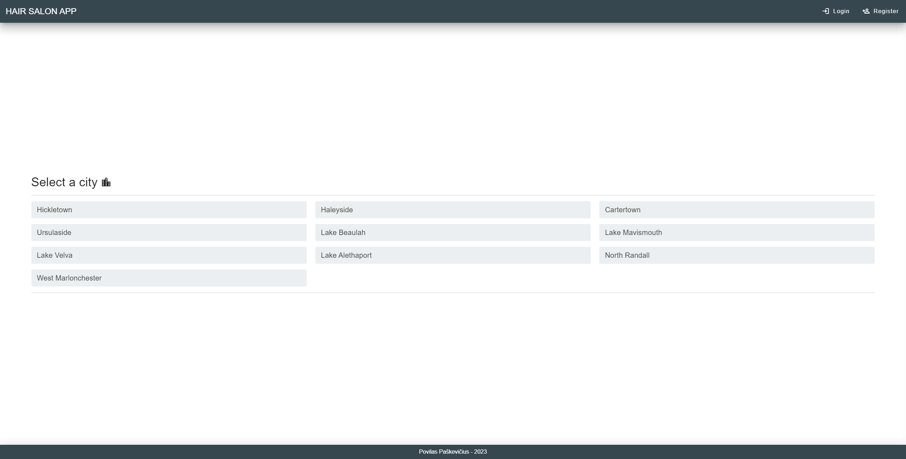
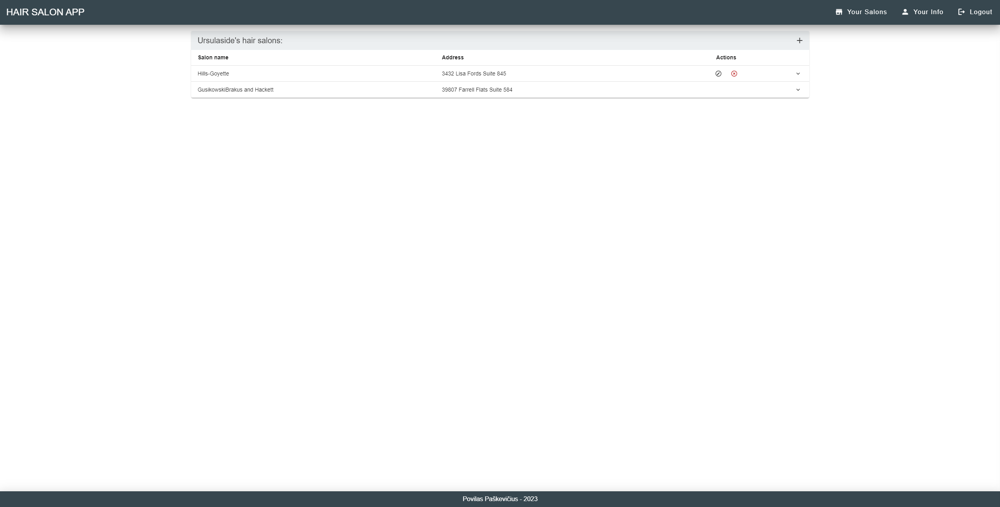
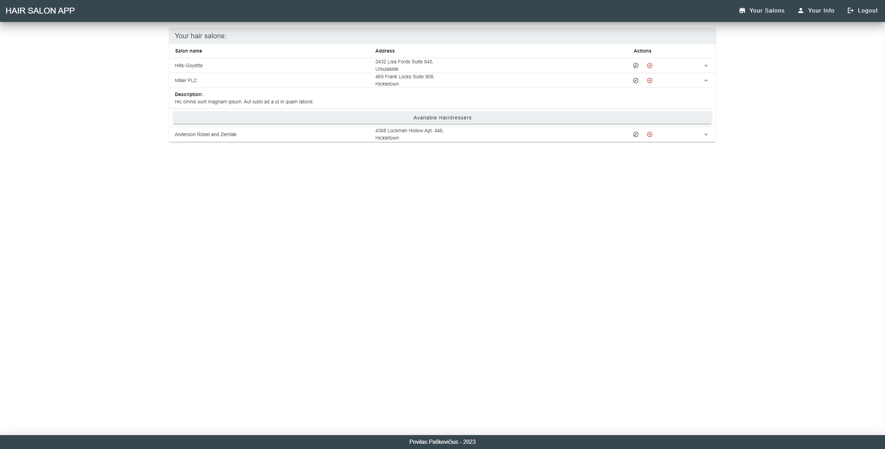
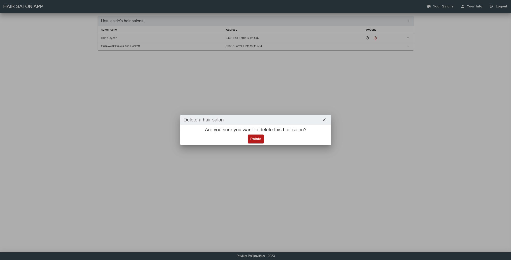
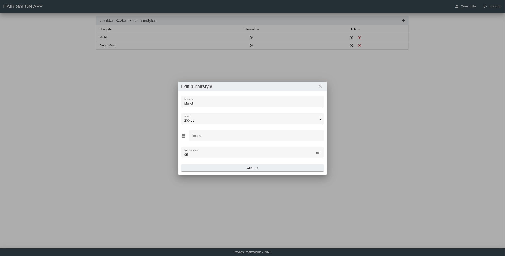

# Kirpyklų sistema
## 1. Scodendžiamo uždavinio aprašymas
###   1.1. Sistemos paskirtis
Pagrindinis projekto tikslas yra padėti kirpykloms surasti klientus, kurie norėtų pasinaudoti paslaugomis teikiamomis minėtose kirpyklose dirbančių kirpėjų.

Kirpyklos vadovas, norėdamas naudotis sistema, turės užsiregistruoti. Tai padarius ir administratoriui patvirtinus kirpyklos vadovo registraciją, jis galės pridėti, šalinti kirpyklas, kurioms vadovauja, pateikti bei atnaujinti informaciją apie jas. Kirpėjai, taip pat galės užsiregistruoti. Užsiregistravęs kirpėjas galės nurodyti, kurioje kirpykloje dirba. Kirpyklos vadovui reikės patvirtinti, kad kirpėjas tikrai dirba jam priklausančioje kirpykloje. Atlikus tai, kirpėjas galės įkelti šukuosenų, kurias moka daryti, nuotraukas, nurodyti bei redaguoti šukuosenų kainas ir kitą informaciją. Jeigu kirpėjas nuscodes nebedaryti vienos iš anksčiau darytų šukuosenų, jis galės pašalinti informaciją apie nebedaromą šukuoseną. Potencialiam klientui bus galima filtruoti (pvz. pagal miestą) bei peržiūrėti sistemoje egzistuojančias kirpyklas, matyti visą informaciją apie pasirinktą kirpyklą bei joje dirbančius kirpėjus, peržiūrėti kirpykloje dirbančio kirpėjo daromas šukuosenas.

###   1.2. Funkciniai reikalavimai
Sistemos svečias galės:
- Peržiūrėti sistemoje egzistuojančias kirpyklas;
- Filtruoti sistemoje egzistuojančias kirpyklas (pvz. pagal miestą);
- Peržiūrėti pasirinktos kirpyklos informaciją;
- Matyti pasirinkto kirpėjo daromas šukuosenas;
- Prisiregistruoti prie sistemos.

Kirpėjas galės:
* Prisijungti prie sistemos;
* Atsijungti nuo sistemos;
* Nurodyti, kurioje kirpykloje dirba;
* Nutraukti darbą kirpykloje;
* Pateikti informaciją apie daromas šukuosenas;
* Redaguoti informaciją apie daromas šukuosenas;
* Šalinti nebedaromas šukuosenas;
* Šalinti paskyrą;
* Atnaujinti paskyros informaciją.

Kirpyklos vadovas galės:
- Prisijungti prie sistemos;
- Atsijungti nuo sistemos;
- Pridėti kirpyklas;
- Atnaujinti kirpyklų informaciją;
- Šalinti kirpyklas;
- Patvirtinti, kad kirpėjas tikrai dirba vadovui priklausančioje kirpykloje;
- Pašalinti kirpėjus dirbančius vadovui priklausančioje kirpykloje;
- Perkelti kirpėjus iš vienos vadovui priklausančios kirpyklos į kitą;
- Šalinti paskyrą;
- Atnaujinti paskyros informaciją.

## 2. Sistemos architektūra
Sistemos sudedamosios dalys:
- Kliento pusė – bus realizuota naudojant Vue.js;
- Serverio pusė – bus realizuota naudojant PHP Laravel;
- Duomenų bazė – MySQL.

Žemiau pavaizduota kuriamos sistemos architektūra pasitelkiant diegimo diagramą.

## 3. Naudotojo sąsaja

|  |
|:--:|
| *Pagrindinis puslapis (naudotojas neprisijungęs)* |
 

|  |
|:--:|
| *Pagrindinis puslapis (naudotojas prisijungęs kaip kirpėjas)* |
 

|  |
|:--:|
| *Pagrindinis puslapis (naudotojas prisijungęs kaip kirpyklų vadovas)* |
 

|  |
|:--:|
| *Registracijos puslapis* |
 

|  |
|:--:|
| *Prisijungimo puslapis* |
 

|  |
|:--:|
| *Prisijungusio naudotojo informacijos redagavimo puslapis* |
 

|  |
|:--:|
| *Paskyros šalinimo modalas* |
 

|  |
|:--:|
| *Miesto kirpyklų sąrašo puslapis (naudotojas neprisijungęs, naudotojas prisijungęs kaip kirpėjas)* |
 

|  |
|:--:|
| *Miesto kirpyklų sąrašo puslapis (naudotojas prisijungęs kaip kirpyklų vadovas)* |
 

|  |
|:--:|
| *Kirpyklų vadovui priklausančių kirpyklų sąrašo puslapis (naudotojas prisijungęs kaip kirpyklų vadovas)* |
 

|  |
|:--:|
| *Kirpyklos sukūrimo modalas* |
 

|  |
|:--:|
| *Kirpyklos redagavimo modalas* |
 

|  |
|:--:|
| *Kirpyklos šalinimo modalas* |
 

|  |
|:--:|
| *Kirpyklos kirpėjų sąrašo puslapis (naudotojas neprisijungęs)* |
 

|  |
|:--:|
| *Kirpyklos kirpėjų sąrašo puslapis (naudotojas prisijungęs kaip kirpėjas)* |
 

|  |
|:--:|
| *Kirpyklos kirpėjų sąrašo puslapis (naudotojas prisijungęs kaip kirpyklų vadovas)* |
 

|  |
|:--:|
| *Kirpėjo nurodymo, kad jis dirba tam tikroje kirpykloje modalas* |
 

|  |
|:--:|
| *Kirpėjo informacijos redagavimo modalas (naudotojas prisijungęs kaip kirpėjas)* |
 

|  |
|:--:|
| *Kirpėjo informacijos redagavimo modalas (naudotojas prisijungęs kaip kirpyklų vadovas)* |
 

|  |
|:--:|
| *Kirpėjo šalinimo iš kirpyklos modalas* |
 

|  |
|:--:|
| *Kirpėjo šukuosenų puslapis (naudotojas neprisijungęs, naudotojas prisijungęs kaip kirpyklų vadovas)* |
 

|  |
|:--:|
| *Kirpėjo šukuosenų sąrašo puslapis (naudotojas prisijungęs kaip kirpėjas)* |
 

|  |
|:--:|
| *Šukuosenos informacijos modalas* |
 

|  |
|:--:|
| *Šukuosenos pridėjimo modalas* |
 

|  |
|:--:|
| *Šukuosenos redagavimo modalas* |
 

|  |
|:--:|
| *Šukuosenos šalinimo modalas* |
 

## 4. API specifikacija

- Atsako formatas: JSON
- Užklausų kiekis: neribotas

### 4.1 Miestų API metodai

<table>
    <tr>
        <td width="500px">API metodas:</td>
        <td width="500px">GET</td>
    </tr>
    <tr>
        <td>Paskirtis:</td>
        <td>Gauti miestų sąrašą</td>
    </tr>
    <tr>
        <td>Pasiekiama per:</td>
        <td>/api/V1/cities</td>
    </tr>
    <tr>
        <td>Užklausos „header“ dalis:</td>
        <td>-</td>
    </tr>
    <tr>
        <td>Užklausos struktūra:</td>
        <td>-</td>
    </tr>
    <tr>
        <td>Atsakymo struktūra:</td>
        <td>
<code>[
    {
        "id": 1,
        "name": "Hickletown"
    },
    {
        "id": 2,
        "name": "Haleyside"
    },
    {
        "id": 3,
        "name": "Cartertown"
    }
]</code>
        </td>
    </tr>
        <tr>
        <td>Galimi atsakymo kodai:</td>
        <td>
            - 200 (OK) 
            - 405 (Method Not Allowed) - nepalaikomas HTTP užklausos metodas
        </td>
    </tr>
</table>

 

<table>
    <tr>
        <td width="500px">API metodas:</td>
        <td width="500px">GET</td>
    </tr>
    <tr>
        <td>Paskirtis:</td>
        <td>Gauti vieno miesto informaciją</td>
    </tr>
    <tr>
        <td>Pasiekiama per:</td>
        <td>/api/V1/cities/{city}</td>
    </tr>
    <tr>
        <td>Užklausos „header“ dalis:</td>
        <td>-</td>
    </tr>
    <tr>
        <td>Užklausos struktūra:</td>
        <td>-</td>
    </tr>
    <tr>
        <td>Atsakymo struktūra:</td>
        <td>
<code>{
    "id": 1,
    "name": "Hickletown"
}</code>
        </td>
    </tr>
        <tr>
        <td>Galimi atsakymo kodai:</td>
        <td>
            - 200 (OK) 
            - 404 (Not Found) - nurodomas neegzistuojantis miesto identifikatorius „city“ 
            - 405 (Method Not Allowed) - nepalaikomas HTTP užklausos metodas
        </td>
    </tr>
</table>

### 4.2 Naudotojo statusų API metodai

<table>
    <tr>
        <td width="500px">API metodas:</td>
        <td width="500px">GET</td>
    </tr>
    <tr>
        <td>Paskirtis:</td>
        <td>Gauti visus galimus naudotojo statusus</td>
    </tr>
    <tr>
        <td>Pasiekiama per:</td>
        <td>/api/V1/statuses</td>
    </tr>
    <tr>
        <td>Užklausos „header“ dalis:</td>
        <td>-</td>
    </tr>
    <tr>
        <td>Užklausos struktūra:</td>
        <td>-</td>
    </tr>
    <tr>
        <td>Atsakymo struktūra:</td>
        <td>
<code>[
    {
        "id": 1,
        "name": "Manager"
    },
    {
        "id": 2,
        "name": "Hairdresser"
    }
]</code>
        </td>
    </tr>
        <tr>
        <td>Galimi atsakymo kodai:</td>
        <td>
            - 200 (OK) 
            - 405 (Method Not Allowed) - nepalaikomas HTTP užklausos metodas
        </td>
    </tr>
</table>

### 4.3 Naudotojų API metodai

<table>
    <tr>
        <td width="500px">API metodas:</td>
        <td width="500px">GET</td>
    </tr>
    <tr>
        <td>Paskirtis:</td>
        <td>Gauti naudotojo duomenis</td>
    </tr>
    <tr>
        <td>Pasiekiama per:</td>
        <td>/api/V1/users/{user}</td>
    </tr>
    <tr>
        <td>Užklausos „header“ dalis:</td>
        <td>Authorization: Bearer {token}</td>
    </tr>
    <tr>
        <td>Užklausos struktūra:</td>
        <td>-</td>
    </tr>
    <tr>
        <td>Atsakymo struktūra:</td>
        <td>
<code>{
    "id": 12,
    "name": "Eiva",
    "surname": "Kavaliauskaitė",
    "email": "larson.angelica@example.com",
    "statusId": 2
}</code>
        </td>
    </tr>
        <tr>
        <td>Galimi atsakymo kodai:</td>
        <td>
            - 200 (OK) 
            - 401 (Unauthorized) - nepateikiamas „token“ arba pateikiamas negaliojantis „token“ 
            - 403 (Forbidden) - naudotojas bando pasiekti ne savo duomenis 
            - 404 (Not Found) - nurodomas neegzistuojantis naudotojo identifikatorius „user“ 
            - 405 (Method Not Allowed) - nepalaikomas HTTP užklausos metodas
        </td>
    </tr>
</table>

 

<table>
    <tr>
        <td width="500px">API metodas:</td>
        <td width="500px">POST</td>
    </tr>
    <tr>
        <td>Paskirtis:</td>
        <td>Naudotojo prisijungimas prie sistemos</td>
    </tr>
    <tr>
        <td>Pasiekiama per:</td>
        <td>/api/V1/users/login</td>
    </tr>
    <tr>
        <td>Užklausos „header“ dalis:</td>
        <td>-</td>
    </tr>
    <tr>
        <td>Užklausos struktūra:</td>
        <td>
<code>{
    "email": "larson.angelica@example.com",
    "password": "password"
}</code>
        </td>
    </tr>
    <tr>
        <td>Atsakymo struktūra:</td>
        <td>
<code>{
    "message": "Successfully logged in",
    "accessToken": "eyJ0eXAiOiJKV1QiLCJhbGciOiJIUz
    I1NiJ9.eyJpc3MiOiJoYWlyX3NhbG9uX2FwcCIsImlhdCI
    6MTcwMjIzODE1OSwiZXhwIjoxNzAyMjQxNzU5LCJuYmYiO
    jE3MDIyMzgxNTksImp0aSI6IlFtQTlKQnVmZUpiY055SnI
    iLCJzdWIiOiIxMiIsInBydiI6IjIzYmQ1Yzg5NDlm>NjAw
    YWRiMzllNzAxYzQwMDg3MmRiN2E1OTc2ZjciLCJyb2xlIj
    oyfQ.WhK1QT49Mm8mYiRPqWO1m1ITDxZsMYvd7_N289fgY
    c",
    "tokenType": "bearer",
    "expiresIn": 3600
}</code>
        </td>
    </tr>
        <tr>
        <td>Galimi atsakymo kodai:</td>
        <td>
            - 200 (OK) 
            - 400 (Bad Request) - JSON pateikiamas klaidingu formatu 
            - 401 (Unauthorized) - įvedami klaidingi prisijungimo duomenys 
            - 405 (Method Not Allowed) - nepalaikomas HTTP užklausos metodas 
            - 422 (Unprocessable Content) - įvedami nevalidūs duomenys
        </td>
    </tr>
</table>

 

<table>
    <tr>
        <td width="500px">API metodas:</td>
        <td width="500px">POST</td>
    </tr>
    <tr>
        <td>Paskirtis:</td>
        <td>Naudotojo registracija prie sistemos</td>
    </tr>
    <tr>
        <td>Pasiekiama per:</td>
        <td>/api/V1/users/register</td>
    </tr>
    <tr>
        <td>Užklausos „header“ dalis:</td>
        <td>-</td>
    </tr>
    <tr>
        <td>Užklausos struktūra:</td>
        <td>
<code>{
    "name": "Petras",
    "surname": "Petraitis",
    "email": "Petras.Petraitis@yahoo.com",
    "password": "Petras_P1",
    "passwordConfirmation": "Petras_P1",
    "statusId": 2
}</code>
        </td>
    </tr>
    <tr>
        <td>Atsakymo struktūra:</td>
        <td>
<code>{
    "id": 30,
    "name": "Petras",
    "surname": "Petraitis",
    "email": "Petras.Petraitis@yahoo.com",
    "statusId": 2
}</code>
        </td>
    </tr>
        <tr>
        <td>Galimi atsakymo kodai:</td>
        <td>
            - 201 (Created) - vartotojo paskyra sukurta 
            - 400 (Bad Request) - JSON pateikiamas klaidingu formatu 
            - 405 (Method Not Allowed) - nepalaikomas HTTP užklausos metodas 
            - 422 (Unprocessable Content) - įvedami nevalidūs registracijos duomenys
        </td>
    </tr>
</table>

 

<table>
    <tr>
        <td width="500px">API metodas:</td>
        <td width="500px">POST</td>
    </tr>
    <tr>
        <td>Paskirtis:</td>
        <td>Naudotojo atsijungimas nuo sistemos</td>
    </tr>
    <tr>
        <td>Pasiekiama per:</td>
        <td>/api/V1/users/logout</td>
    </tr>
    <tr>
        <td>Užklausos „header“ dalis:</td>
        <td>Authorization: bearer {token}</td>
    </tr>
    <tr>
        <td>Užklausos struktūra:</td>
        <td>-</td>
    </tr>
    <tr>
        <td>Atsakymo struktūra:</td>
        <td>
<code>{
    "message": "Successfully logged out"
}</code>
        </td>
    </tr>
        <tr>
        <td>Galimi atsakymo kodai:</td>
        <td>
            - 200 (OK) 
            - 401 (Unauthorized) - nepateikiamas „token“ arba pateikiamas negaliojantis „token“ 
            - 405 (Method Not Allowed) - nepalaikomas HTTP užklausos metodas
        </td>
    </tr>
</table>

 

<table>
    <tr>
        <td width="500px">API metodas:</td>
        <td width="500px">POST</td>
    </tr>
    <tr>
        <td>Paskirtis:</td>
        <td>Atnaujinti JWT žetoną</td>
    </tr>
    <tr>
        <td>Pasiekiama per:</td>
        <td>/api/V1/users/refresh</td>
    </tr>
    <tr>
        <td>Užklausos „header“ dalis:</td>
        <td>Authorization: bearer {token}</td>
    </tr>
    <tr>
        <td>Užklausos struktūra:</td>
        <td>-</td>
    </tr>
    <tr>
        <td>Atsakymo struktūra:</td>
        <td>
<code>{
    "message": "Token successfully refreshed",
    "accessToken": "eyJ0eXAiOiJKV1QiLCJhbGciOiJIUz
    I1NiJ9.eyJpc3MiOiJoYWlyX3NhbG9uX2FwcCIsImlhdCI
    6MTcwMjIzOTg0NCwiZXhwIjoxNzAyMjQzNDU3LCJuYmYiO
    jE3MDIyMzk4NTcsImp0aSI6IlRzc1hSYTBZNHNZZEJzNWo
    iLCJzdWIiOiIxMiIsInBydiI6IjIzYmQ1Yzg5NDlmNjAwY
    WRiMzllNzAxYzQwMDg3MmRiN2E1OTc2ZjciLCJyb2xlIjo
    yfQ.SciBAmYb81nS4N0jtrSt4MX_IJMx3ObzmDzWzjf2_X
    0",
    "tokenType": "bearer",
    "expiresIn": 3600
}</code>
        </td>
    </tr>
        <tr>
        <td>Galimi atsakymo kodai:</td>
        <td>
            - 200 (OK) 
            - 401 (Unauthorized) - nepateikiamas „token“ arba pateikiamas negaliojantis „token“ 
            - 405 (Method Not Allowed) - nepalaikomas HTTP užklausos metodas
        </td>
    </tr>
</table>

 

<table>
    <tr>
        <td width="500px">API metodas:</td>
        <td width="500px">PATCH</td>
    </tr>
    <tr>
        <td>Paskirtis:</td>
        <td>Redaguoti naudotojo duomenis</td>
    </tr>
    <tr>
        <td>Pasiekiama per:</td>
        <td>/api/V1/users/{user}</td>
    </tr>
    <tr>
        <td>Užklausos „header“ dalis:</td>
        <td>Authorization: bearer {token}</td>
    </tr>
    <tr>
        <td>Užklausos struktūra:</td>
        <td>
<code>{
    "name": "Eva",
    "surname": "Kava",
    "email": "Eva.Kava@gmail.com",
    "password": "Password_1",
    "passwordConfirmation": "Password_1"
}</code>
        </td>
    </tr>
    <tr>
        <td>Atsakymo struktūra:</td>
        <td>
<code>{
    "id": 12,
    "name": "Eva",
    "surname": "Kava",
    "email": "Eva.Kava@gmail.com",
    "statusId": 2
}</code>
        </td>
    </tr>
        <tr>
        <td>Galimi atsakymo kodai:</td>
        <td>
            - 200 (OK) 
            - 400 (Bad Request) - JSON pateikiamas klaidingu formatu 
            - 401 (Unauthorized) - nepateikiamas „token“ arba pateikiamas negaliojantis „token“ 
            - 403 (Forbidden) - naudotojas bando redaguoti ne savo duomenis 
            - 405 (Method Not Allowed) - nepalaikomas HTTP užklausos metodas 
            - 422 (Unprocessable Content) - įvedami nevalidūs registracijos duomenys
        </td>
    </tr>
</table>

 

<table>
    <tr>
        <td width="500px">API metodas:</td>
        <td width="500px">DELETE</td>
    </tr>
    <tr>
        <td>Paskirtis:</td>
        <td>Panaikinti naudotojo paskyrą</td>
    </tr>
    <tr>
        <td>Pasiekiama per:</td>
        <td>/api/V1/users/{user}</td>
    </tr>
    <tr>
        <td>Užklausos „header“ dalis:</td>
        <td>Authorization: bearer {token}</td>
    </tr>
    <tr>
        <td>Užklausos struktūra:</td>
        <td>-</td>
    </tr>
    <tr>
        <td>Atsakymo struktūra:</td>
        <td>-</td>
    </tr>
        <tr>
        <td>Galimi atsakymo kodai:</td>
        <td>
            - 204 (No Content) - sėkmingai pašalinta naudotojo paskyra 
            - 401 (Unauthorized) - nepateikiamas „token“ arba pateikiamas negaliojantis „token“ 
            - 403 (Forbidden) - naudotojas bando pašalinti ne savo paskyrą 
            - 405 (Method Not Allowed) - nepalaikomas HTTP užklausos metodas
        </td>
    </tr>
</table>

### 4.4 Kirpyklų API metodai

<table>
    <tr>
        <td width="500px">API metodas:</td>
        <td width="500px">GET</td>
    </tr>
    <tr>
        <td>Paskirtis:</td>
        <td>Gauti tam tikro miesto kirpyklų informaciją</td>
    </tr>
    <tr>
        <td>Pasiekiama per:</td>
        <td>/api/V1/cities/{city}/hair-salons</td>
    </tr>
    <tr>
        <td>Užklausos „header“ dalis:</td>
        <td>-</td>
    </tr>
    <tr>
        <td>Užklausos struktūra:</td>
        <td>-</td>
    </tr>
    <tr>
        <td>Atsakymo struktūra:</td>
        <td>
<code>[
    {
        "id": 2,
        "name": "Miller PLC",
        "cityId": 1,
        "cityName": "Hickletown",
        "address": "469 Frank Locks Suite 908",
        "description": "Hic omnis sunt magnam ipsum. Aut iusto ad a ut in quam labore.",
        "managerId": 1
    },
    {
        "id": 3,
        "name": "Anderson Robel and Zemlak",
        "cityId": 1,
        "cityName": "Hickletown",
        "address": "4368 Lockman Hollow Apt. 446",
        "description": "Accusamus occaecati nam excepturi. Aut eum libero sequi quibusdam non corporis hic. Sint laborum mollitia id non quos perspiciatis. Dolorem soluta aspernatur nesciunt in ut iusto tempora.",
        "managerId": 1
    }
]</code>
        </td>
    </tr>
        <tr>
        <td>Galimi atsakymo kodai:</td>
        <td>
            - 200 (OK) 
            - 404 (Not Found) -  nurodomas neegzistuojantis miesto identifikatorius „city“ 
            - 405 (Method Not Allowed) - nepalaikomas HTTP užklausos metodas
        </td>
    </tr>
</table>

 

<table>
    <tr>
        <td width="500px">API metodas:</td>
        <td width="500px">GET</td>
    </tr>
    <tr>
        <td>Paskirtis:</td>
        <td>Gauti tam tikro miesto kirpyklos informaciją</td>
    </tr>
    <tr>
        <td>Pasiekiama per:</td>
        <td>/api/V1/cities/{city}/hair-salons/{salon}</td>
    </tr>
    <tr>
        <td>Užklausos „header“ dalis:</td>
        <td>-</td>
    </tr>
    <tr>
        <td>Užklausos struktūra:</td>
        <td>-</td>
    </tr>
    <tr>
        <td>Atsakymo struktūra:</td>
        <td>
<code>{
    "id": 2,
    "name": "Miller PLC",
    "cityId": 1,
    "cityName": "Hickletown",
    "address": "469 Frank Locks Suite 908",
    "description": "Hic omnis sunt magnam ipsum. Aut iusto ad a ut in quam labore.",
    "managerId": 1
}</code>
        </td>
    </tr>
        <tr>
        <td>Galimi atsakymo kodai:</td>
        <td>
            - 200 (OK) 
            - 404 (Not Found) - įvedamas klaidingas kelias, nurodomas neegzistuojantis miesto identifikatorius „city“, kirpyklos identifikatorius „salon“ arba nurodytame mieste neegzistuoja nurodyta kirpykla 
            - 405 (Method Not Allowed) - nepalaikomas HTTP užklausos metodas
        </td>
    </tr>
</table>

 

<table>
    <tr>
        <td width="500px">API metodas:</td>
        <td width="500px">POST</td>
    </tr>
    <tr>
        <td>Paskirtis:</td>
        <td>Sukurti naują kirpyklą</td>
    </tr>
    <tr>
        <td>Pasiekiama per:</td>
        <td>/api/V1/cities/{city}/hair-salons</td>
    </tr>
    <tr>
        <td>Užklausos „header“ dalis:</td>
        <td>Authorization: bearer {token}</td>
    </tr>
    <tr>
        <td>Užklausos struktūra:</td>
        <td>
<code>{
    "name": "Povilo kirpykla",
    "address": "170 S Florida St",
    "description": "Lorem ipsum dolor sit amet, consectetur adipiscing elit. Aenean vitae arcu ut dui sodales mollis. Morbi viverra tortor at elit pulvinar, fringilla venenatis lectus commodo. Nunc felis quam, tincidunt et erat id, semper hendrerit erat. Ut luctus libero a velit sagittis, et posuere nisl lobortis. Nullam ut maximus erat. Morbi et erat eget eros vulputate blandit eu et nibh. Nam a nisi purus. Morbi scelerisque imperdiet erat eu hendrerit. Proin molestie risus et diam blandit dapibus quis eget metus. Etiam id lorem vel est vulputate consectetur."
}</code>
        </td>
    </tr>
    <tr>
        <td>Atsakymo struktūra:</td>
        <td>
<code>{
    "id": 16,
    "name": "Povilo kirpykla",
    "cityId": 1,
    "cityName": "Hickletown",
    "address": "170 S Florida St",
    "description": "Lorem ipsum dolor sit amet, consectetur adipiscing elit. Aenean vitae arcu ut dui sodales mollis. Morbi viverra tortor at elit pulvinar, fringilla venenatis lectus commodo. Nunc felis quam, tincidunt et erat id, semper hendrerit erat. Ut luctus libero a velit sagittis, et posuere nisl lobortis. Nullam ut maximus erat. Morbi et erat eget eros vulputate blandit eu et nibh. Nam a nisi purus. Morbi scelerisque imperdiet erat eu hendrerit. Proin molestie risus et diam blandit dapibus quis eget metus. Etiam id lorem vel est vulputate consectetur.",
    "managerId": 1
}</code>
        </td>
    </tr>
        <tr>
        <td>Galimi atsakymo kodai:</td>
        <td>
            - 201 (Created) - sėkmingai sukurta nauja kirpykla 
            - 400 (Bad Request) - JSON pateikiamas klaidingu formatu 
            - 401 (Unauthorized) - nepateikiamas „token“ arba pateikiamas negaliojantis „token“ 
            - 403 (Forbidden) - naudotojas bando pridėti kirpyklą neturėdamas kirpyklų vadovo statuso 
            - 404 (Not Found) - nurodomas neegzistuojantis miesto identifikatorius „city“ 
            - 405 (Method Not Allowed) - nepalaikomas HTTP užklausos metodas 
            - 422 (Unporcessable Content) - įvedami nevalidūs duomenys
        </td>
    </tr>
</table>

 

<table>
    <tr>
        <td width="500px">API metodas:</td>
        <td width="500px">PUT</td>
    </tr>
    <tr>
        <td>Paskirtis:</td>
        <td>Redaguoti kirpyklos informaciją</td>
    </tr>
    <tr>
        <td>Pasiekiama per:</td>
        <td>/api/V1/cities/{city}/hair-salons/{salon}</td>
    </tr>
    <tr>
        <td>Užklausos „header“ dalis:</td>
        <td>Authorization: bearer {token}</td>
    </tr>
    <tr>
        <td>Užklausos struktūra:</td>
        <td>
<code>{
    "name": "Kirpykla",
    "address": "1819 S El Camino Real",
    "description": "Morbi scelerisque imperdiet erat eu hendrerit. Proin molestie risus et diam blandit dapibus quis eget metus. Etiam id lorem vel est vulputate consectetur."
}</code>
        </td>
    </tr>
    <tr>
        <td>Atsakymo struktūra:</td>
        <td>
<code>{
    "id": 2,
    "name": "Kirpykla",
    "cityId": 1,
    "cityName": "Hickletown",
    "address": "1819 S El Camino Real",
    "description": "Morbi scelerisque imperdiet erat eu hendrerit. Proin molestie risus et diam blandit dapibus quis eget metus. Etiam id lorem vel est vulputate consectetur.",
    "managerId": 1
}</code>
        </td>
    </tr>
        <tr>
        <td>Galimi atsakymo kodai:</td>
        <td>
            - 200 (OK) 
            - 400 (Bad Request) - JSON pateikiamas klaidingu formatu 
            - 401 (Unauthorized) - nepateikiamas „token“ arba pateikiamas negaliojantis „token“ 
            - 403 (Forbidden) - kirpyklų vadovas bando redaguoti kitam kirpyklų vadovui priklausančios kirpyklos informaciją 
            - 404 (Not Found) - nurodomas neegzistuojantis miesto identifikatorius „city“, nurodomas mieste neegzistuojančios kirpyklos identifikatorius „salon“ 
            - 405 (Method Not Allowed) - nepalaikomas HTTP užklausos metodas 
            - 422 (Unporcessable Content) - įvedami nevalidūs duomenys
        </td>
    </tr>
</table>

 

<table>
    <tr>
        <td width="500px">API metodas:</td>
        <td width="500px">DELETE</td>
    </tr>
    <tr>
        <td>Paskirtis:</td>
        <td>Pašalinti kirpyklą</td>
    </tr>
    <tr>
        <td>Pasiekiama per:</td>
        <td>/api/V1/cities/{city}/hair-salons/{salon}</td>
    </tr>
    <tr>
        <td>Užklausos „header“ dalis:</td>
        <td>Authorization: bearer {token}</td>
    </tr>
    <tr>
        <td>Užklausos struktūra:</td>
        <td>-</td>
    </tr>
    <tr>
        <td>Atsakymo struktūra:</td>
        <td>-</td>
    </tr>
        <tr>
        <td>Galimi atsakymo kodai:</td>
        <td>
            - 204 (No Content) - kirpykla sėkmingai pašalinta 
            - 401 (Unauthorized) - nepateikiamas „token“ arba pateikiamas negaliojantis „token“ 
            - 403 (Forbidden) - kirpyklų vadovas bando šalinti kitam kirpyklų vadovui priklausančią kirpyklą 
            - 404 (Not Found) - nurodomas neegzistuojantis miesto identifikatorius „city“, nurodomas mieste neegzistuojančios kirpyklos identifikatorius „salon“ 
            - 405 (Method Not Allowed) - nepalaikomas HTTP užklausos metodas
        </td>
    </tr>
</table>

### 4.5 Kirpėjų API metodai

<table>
    <tr>
        <td width="500px">API metodas:</td>
        <td width="500px">GET</td>
    </tr>
    <tr>
        <td>Paskirtis:</td>
        <td>Gauti tam tikroje kirpykloje dirbančių kirpėjų sąrašą</td>
    </tr>
    <tr>
        <td>Pasiekiama per:</td>
        <td>/api/V1/cities/{city}/hair-salons/{salon}/hairdressers</td>
    </tr>
    <tr>
        <td>Užklausos „header“ dalis:</td>
        <td>-</td>
    </tr>
    <tr>
        <td>Užklausos struktūra:</td>
        <td>-</td>
    </tr>
    <tr>
        <td>Atsakymo struktūra:</td>
        <td>
<code>[
    {
        "id": 11,
        "name": "Gelena",
        "surname": "Jankauskienė",
        "phoneNr": "846842488",
        "email": "jarvis85@example.com",
        "isApproved": 1,
        "hairSalonId": 3
    },
    {
        "id": 12,
        "name": "Eva",
        "surname": "Kava",
        "phoneNr": "8765432",
        "email": "Eva.Kava@gmail.com",
        "isApproved": 1,
        "hairSalonId": 3
    }
]</code>
        </td>
    </tr>
        <tr>
        <td>Galimi atsakymo kodai:</td>
        <td>
            - 200 (OK) 
            - 404 (Not Found) - nurodomas neegzistuojantis miesto identifikatorius „city“, nurodomas mieste neegzistuojančios kirpyklos identifikatorius „salon“ 
            - 405 (Method Not Allowed) - nepalaikomas HTTP užklausos metodas
        </td>
    </tr>
</table>

 

<table>
    <tr>
        <td width="500px">API metodas:</td>
        <td width="500px">GET</td>
    </tr>
    <tr>
        <td>Paskirtis:</td>
        <td>Gauti tam tikroje kirpykloje dirbančio kirpėjo informaciją</td>
    </tr>
    <tr>
        <td>Pasiekiama per:</td>
        <td>/api/V1/cities/{city}/hair-salons/{salon}/hairdressers/{hairdresser}</td>
    </tr>
    <tr>
        <td>Užklausos „header“ dalis:</td>
        <td>-</td>
    </tr>
    <tr>
        <td>Užklausos struktūra:</td>
        <td>-</td>
    </tr>
    <tr>
        <td>Atsakymo struktūra:</td>
        <td>
<code>{
    "id": 11,
    "name": "Gelena",
    "surname": "Jankauskienė",
    "phoneNr": "846842488",
    "email": "jarvis85@example.com",
    "isApproved": 1,
    "hairSalonId": 3
}</code>
        </td>
    </tr>
        <tr>
        <td>Galimi atsakymo kodai:</td>
        <td>
            - 200 (OK) 
            - 403 (Forbidden) - naudotojas bando pasiekti nepatvirtinto kirpėjo informaciją (naudotojas nėra kirpėjas, kurio informaciją bandoma pasiekti, naudotojas nėra kirpyklos, kurioje dirba nepatvirtintas kirpėjas, vadovas) 
            - 404 (Not Found) - nurodomas neegzistuojantis miesto identifikatorius „city“, nurodomas mieste neegzistuojančios kirpyklos identifikatorius „salon“, nurodomas kirpykloje nedirbančio kirpėjo identifikatorius „hairdresser“ 
            - 405 (Method Not Allowed) - nepalaikomas HTTP užklausos metodas
        </td>
    </tr>
</table>

 

<table>
    <tr>
        <td width="500px">API metodas:</td>
        <td width="500px">POST</td>
    </tr>
    <tr>
        <td>Paskirtis:</td>
        <td>Nurodyti, kad kirpėjas dirba tam tikroje kirpykloje</td>
    </tr>
    <tr>
        <td>Pasiekiama per:</td>
        <td>/api/V1/cities/{city}/hair-salons/{salon}/hairdressers</td>
    </tr>
    <tr>
        <td>Užklausos „header“ dalis:</td>
        <td>Authorization: bearer {token}</td>
    </tr>
    <tr>
        <td>Užklausos struktūra:</td>
        <td>
<code>{
    "phoneNr": "+37012345678"
}</code>
        </td>
    </tr>
    <tr>
        <td>Atsakymo struktūra:</td>
        <td>
<code>{
    "id": 26,
    "name": "Povilas",
    "surname": "Petraitis",
    "phoneNr": "+37012345678",
    "email": "povilas.petraitis@gmail.com",
    "isApproved": 0,
    "hairSalonId": 2
}</code>
        </td>
    </tr>
        <tr>
        <td>Galimi atsakymo kodai:</td>
        <td>
            - 201 (Created) - kirpėjas sėkmingai pridėtas prie kirpyklos 
            - 400 (Bad Request) - JSON pateikiamas klaidingu formatu 
            - 401 (Unauthorized) - nepateikiamas „token“ arba pateikiamas negaliojantis „token“ 
            - 403 (Forbidden) - naudotojas bando pridėti kirpėja prie kirpyklos neturėdamas kirpėjo statuso 
            - 404 (Not Found) - nurodomas neegzistuojantis miesto identifikatorius „city“, nurodomas mieste neegzistuojančios kirpyklos identifikatorius „salon“ 
            - 405 (Method Not Allowed) - nepalaikomas HTTP užklausos metodas 
            - 409 (Conflict) - prie kirpyklos bandoma pridėti kirpėją, kuris jau dirbą kirpykoje 
            - 422 (Unprocessable Content) - įvedami nevalidūs duomenys
        </td>
    </tr>
</table>

 

<table>
    <tr>
        <td width="500px">API metodas:</td>
        <td width="500px">PUT</td>
    </tr>
    <tr>
        <td>Paskirtis:</td>
        <td>Redaguoti kirpėjo informaciją</td>
    </tr>
    <tr>
        <td>Pasiekiama per:</td>
        <td>/api/V1/cities/{city}/hair-salons/{salon}/hairdressers/{hairdresser}</td>
    </tr>
    <tr>
        <td>Užklausos „header“ dalis:</td>
        <td>Authorization: bearer {token}</td>
    </tr>
    <tr>
        <td>Užklausos struktūra:</td>
        <td>
<code>{
    "phoneNr": "+37012345678",
    "isApproved": "1",
    "hairSalonId": "2"
}</code>
        </td>
    </tr>
    <tr>
        <td>Atsakymo struktūra:</td>
        <td>
<code>{
    "id": 26,
    "name": "Povilas",
    "surname": "Petraitis",
    "phoneNr": "+37012345678",
    "email": "povilas.petraitis@gmail.com",
    "isApproved": 1,
    "hairSalonId": 2
}</code>
        </td>
    </tr>
        <tr>
        <td>Galimi atsakymo kodai:</td>
        <td>
            - 200 (OK) 
            - 400 (Bad Request) - JSON pateikiamas klaidingu formatu 
            - 401 (Unauthorized) - nepateikiamas „token“ arba pateikiamas negaliojantis „token“ 
            - 403 (Forbidden) - kirpėjas bando redaguoti kito kirpėjo informaciją, kirpyklų vadovas bando redaguoti jam nepriklausančios kirpyklos kirpėjų informaciją, naudotojas bando redaguoti laukus, kurių negali redaguoti (kirpėjas gali redaguoti: „phoneNr“, kirpyklos, kurioje dirba kirpėjas, vadovas gali redaguoti: „isApproved“, „hairSalonId“), kirpyklos, kurioje dirba kirpėjas, vadovas bando perkelti kirpėją į kirpyklą, kuri jam nepriklauso 
            - 404 (Not Found) - nurodomas neegzistuojantis miesto identifikatorius „city“, nurodomas mieste neegzistuojančios kirpyklos identifikatorius „salon“, nurodomas kirpykloje nedirbančio kirpėjo identifikatorius „hairdresser“ 
            - 405 (Method Not Allowed) - nepalaikomas HTTP užklausos metodas 
            - 422 (Unprocessable Content) - įvedami nevalidūs duomenys
        </td>
    </tr>
</table>

 

<table>
    <tr>
        <td width="500px">API metodas:</td>
        <td width="500px">DELETE</td>
    </tr>
    <tr>
        <td>Paskirtis:</td>
        <td>Pašalinti kirpėją iš kirpyklos</td>
    </tr>
    <tr>
        <td>Pasiekiama per:</td>
        <td>/api/V1/cities/{city}/hair-salons/{salon}/hairdressers/{hairdresser}</td>
    </tr>
    <tr>
        <td>Užklausos „header“ dalis:</td>
        <td>Authorization: bearer {token}</td>
    </tr>
    <tr>
        <td>Užklausos struktūra:</td>
        <td>-</td>
    </tr>
    <tr>
        <td>Atsakymo struktūra:</td>
        <td>-</td>
    </tr>
        <tr>
        <td>Galimi atsakymo kodai:</td>
        <td>
            - 204 (No Content) - kirpėjas sėkmingai pašalintas iš kirpyklos 
            - 401 (Unauthorized) - nepateikiamas „token“ arba pateikiamas negaliojantis „token“ 
            - 403 (Forbidden) -  kirpėjas bando šalinti kitą kirpėją iš kirpyklos, kirpyklų vadovas bando šalinti jam nepriklausančios kirpyklos kirpėjus 
            - 404 (Not Found) - nurodomas neegzistuojantis miesto identifikatorius „city“, nurodomas mieste neegzistuojančios kirpyklos identifikatorius „salon“, nurodomas kirpykloje nedirbančio kirpėjo identifikatorius „hairdresser“ 
            - 405 (Method Not Allowed) - nepalaikomas HTTP užklausos metodas
        </td>
    </tr>
</table>

### 4.6 Šukuosenų API metodai

<table>
    <tr>
        <td width="500px">API metodas:</td>
        <td width="500px">GET</td>
    </tr>
    <tr>
        <td>Paskirtis:</td>
        <td>Gauti kirpėjo šukuosenų sąrašą</td>
    </tr>
    <tr>
        <td>Pasiekiama per:</td>
        <td>/api/V1/cities/{city}/hair-salons/{salon}/hairdressers/{hairdresser}/hairstyles</td>
    </tr>
    <tr>
        <td>Užklausos „header“ dalis:</td>
        <td>-</td>
    </tr>
    <tr>
        <td>Užklausos struktūra:</td>
        <td>-</td>
    </tr>
    <tr>
        <td>Atsakymo struktūra:</td>
        <td>
<code>[
    {
        "id": 2,
        "name": "Mullet",
        "price": 250.09,
        "image": "https://via.placeholder.com/640x480.png/004499?text=porro",
        "estimatedTimeMin": 95,
        "hairdresserId": 8
    },
    {
        "id": 3,
        "name": "French Crop",
        "price": 718.36,
        "image": "https://via.placeholder.com/640x480.png/005599?text=eligendi",
        "estimatedTimeMin": 104,
        "hairdresserId": 8
    }
]</code>
        </td>
    </tr>
        <tr>
        <td>Galimi atsakymo kodai:</td>
        <td>
            - 200 (OK) 
            - 404 (Not Found) - nurodomas neegzistuojantis miesto identifikatorius „city“, nurodomas mieste neegzistuojančios kirpyklos identifikatorius „salon“, nurodomas kirpykloje nedirbančio kirpėjo identifikatorius „hairdresser“ 
            - 405 (Method Not Allowed) - nepalaikomas HTTP užklausos metodas
        </td>
    </tr>
</table>

 

<table>
    <tr>
        <td width="500px">API metodas:</td>
        <td width="500px">GET</td>
    </tr>
    <tr>
        <td>Paskirtis:</td>
        <td>Gauti kirpėjo šukuoseną</td>
    </tr>
    <tr>
        <td>Pasiekiama per:</td>
        <td>/api/V1/cities/{city}/hair-salons/{salon}/hairdressers/{hairdresser}/ hairstyles/{hairstyle}</td>
    </tr>
    <tr>
        <td>Užklausos „header“ dalis:</td>
        <td>-</td>
    </tr>
    <tr>
        <td>Užklausos struktūra:</td>
        <td>-</td>
    </tr>
    <tr>
        <td>Atsakymo struktūra:</td>
        <td>
<code>{
    "id": 2,
    "name": "Mullet",
    "price": 250.09,
    "image": "https://via.placeholder.com/640x480.png/004499?text=porro",
    "estimatedTimeMin": 95,
    "hairdresserId": 8
}</code>
        </td>
    </tr>
        <tr>
        <td>Galimi atsakymo kodai:</td>
        <td>
            - 200 (OK) 
            - 404 (Not Found) - nurodomas neegzistuojantis miesto identifikatorius „city“, nurodomas mieste neegzistuojančios kirpyklos identifikatorius „salon“, nurodomas kirpykloje nedirbančio kirpėjo identifikatorius „hairdresser“, nurodomas neegzistuojantis kirpėjo šukuosenos identifikatorius „hairstyle“ 
            - 405 (Method Not Allowed) - nepalaikomas HTTP užklausos metodas
        </td>
    </tr>
</table>

 

<table>
    <tr>
        <td width="500px">API metodas:</td>
        <td width="500px">POST</td>
    </tr>
    <tr>
        <td>Paskirtis:</td>
        <td>Pridėti naują šukuoseną</td>
    </tr>
    <tr>
        <td>Pasiekiama per:</td>
        <td>/api/V1/cities/{city}/hair-salons/{salon}/hairdressers/{hairdresser}/hairstyles</td>
    </tr>
    <tr>
        <td>Užklausos „header“ dalis:</td>
        <td>Authorization: bearer {token}</td>
    </tr>
    <tr>
        <td>Užklausos struktūra:</td>
        <td>
<code>{
    "name": "Hairstyle",
    "price": "22.51",
    "image": null,
    "estimatedTimeMin": 22
}</code>
        </td>
    </tr>
    <tr>
        <td>Atsakymo struktūra:</td>
        <td>
<code>{
    "id": 29,
    "name": "Hairstyle",
    "price": "22.51",
    "image": "http://localhost:8000/storage/no-image.png",
    "estimatedTimeMin": 22,
    "hairdresserId": 26
}</code>
        </td>
    </tr>
        <tr>
        <td>Galimi atsakymo kodai:</td>
        <td>
            - 201 (Creater) - šukuosena sėkmingai sukurta 
            - 400 (Bad Request) - JSON pateikiamas klaidingu formatu 
            - 401 (Unauthorized) - nepateikiamas „token“ arba pateikiamas negaliojantis „token“ 
            - 403 (Forbidden) - nepatvirtintas kirpėjas bando pridėti šukuoseną, kirpėjas bando pridėti šukuoseną kitam kirpėjui 
            - 404 (Not Found) - nurodomas neegzistuojantis miesto identifikatorius „city“, nurodomas mieste neegzistuojančios kirpyklos identifikatorius „salon“, nurodomas kirpykloje nedirbančio kirpėjo identifikatorius „hairdresser“ 
            - 405 (Method Not Allowed) - nepalaikomas HTTP užklausos metodas 
            - 422 (Unprocessable content) - įvedami nevalidūs duomenys
        </td>
    </tr>
</table>

 

<table>
    <tr>
        <td width="500px">API metodas:</td>
        <td width="500px">PATCH</td>
    </tr>
    <tr>
        <td>Paskirtis:</td>
        <td>Redaguoti šukuosenos informaciją</td>
    </tr>
    <tr>
        <td>Pasiekiama per:</td>
        <td>/api/V1/cities/{city}/hair-salons/{salon}/hairdressers/{hairdresser}/ hairstyles/{hairstyle}</td>
    </tr>
    <tr>
        <td>Užklausos „header“ dalis:</td>
        <td>Authorization: bearer {token}</td>
    </tr>
    <tr>
        <td>Užklausos struktūra:</td>
        <td>
<code>{
    "name": "Bowlcut",
    "price": "22.51",
    "image": null,
    "estimatedTimeMin": 30
}</code>
        </td>
    </tr>
    <tr>
        <td>Atsakymo struktūra:</td>
        <td>
<code>{
    "id": 29,
    "name": "Bowlcut",
    "price": "22.51",
    "image": "http://localhost:8000/storage/no-image.png",
    "estimatedTimeMin": 30,
    "hairdresserId": 26
}</code>
        </td>
    </tr>
        <tr>
        <td>Galimi atsakymo kodai:</td>
        <td>
            - 200 (OK) 
            - 400 (Bad Request) - JSON pateikiamas klaidingu formatu 
            - 401 (Unauthorized) - nepateikiamas „token“ arba pateikiamas negaliojantis „token“ 
            - 403 (Forbidden) - nepatvirtintas kirpėjas bando redaguoti šukuoseną, kirpėjas bando redaguoti kito kirpėjo šukuoseną 
            - 404 (Not Found) - nurodomas neegzistuojantis miesto identifikatorius „city“, nurodomas mieste neegzistuojančios kirpyklos identifikatorius „salon“, nurodomas kirpykloje nedirbančio kirpėjo identifikatorius „hairdresser“, nurodomas neegzistuojantis kirpėjo šukuosenos identifikatorius „hairstyle“ 
            - 405 (Method Not Allowed) - nepalaikomas HTTP užklausos metodas 
            - 422 (Unprocessable content) - įvedami nevalidūs duomenys
        </td>
    </tr>
</table>

 

<table>
    <tr>
        <td width="500px">API metodas:</td>
        <td width="500px">DELETE</td>
    </tr>
    <tr>
        <td>Paskirtis:</td>
        <td>pašalinti šukuoseną</td>
    </tr>
    <tr>
        <td>Pasiekiama per:</td>
        <td>/api/V1/cities/{city}/hair-salons/{salon}/hairdressers/{hairdresser}/ hairstyles/{hairstyle}</td>
    </tr>
    <tr>
        <td>Užklausos „header“ dalis:</td>
        <td>Authorization: bearer {token}</td>
    </tr>
    <tr>
        <td>Užklausos struktūra:</td>
        <td>-</td>
    </tr>
    <tr>
        <td>Atsakymo struktūra:</td>
        <td>-</td>
    </tr>
        <tr>
        <td>Galimi atsakymo kodai:</td>
        <td>
            - 204 (No Content) - Šukuosena sėkmingai pašalinta 
            - 401 (Unauthorized) - nepateikiamas „token“ arba pateikiamas negaliojantis „token“ 
            - 403 (Forbidden) - nepatvirtintas kirpėjas bando šalinti šukuoseną, kirpėjas bando šalinti kito kirpėjo šukuoseną 
            - 404 (Not Found) - nurodomas neegzistuojantis miesto identifikatorius „city“, nurodomas mieste neegzistuojančios kirpyklos identifikatorius „salon“, nurodomas kirpykloje nedirbančio kirpėjo identifikatorius „hairdresser“, nurodomas neegzistuojantis kirpėjo šukuosenos identifikatorius „hairstyle“ 
            - 405 (Method Not Allowed) - nepalaikomas HTTP užklausos metodas
        </td>
    </tr>
</table>

### 4.7 Kirpyklų vadovų API metodai

<table>
    <tr>
        <td width="500px">API metodas:</td>
        <td width="500px">GET</td>
    </tr>
    <tr>
        <td>Paskirtis:</td>
        <td>Gauti kirpyklų vadovo kirpyklų sąrašą</td>
    </tr>
    <tr>
        <td>Pasiekiama per:</td>
        <td>/api/V1/managers/{manager}/hair-salons</td>
    </tr>
    <tr>
        <td>Užklausos „header“ dalis:</td>
        <td>Authorization: bearer {token}</td>
    </tr>
    <tr>
        <td>Užklausos struktūra:</td>
        <td>-</td>
    </tr>
    <tr>
        <td>Atsakymo struktūra:</td>
        <td>
<code>[
    {
        "id": 1,
        "name": "Hills-Goyette",
        "cityId": 4,
        "cityName": "Ursulaside",
        "address": "3432 Lisa Fords Suite 845",
        "description": "Omnis iusto occaecati aut autem quia nihil dolor. Corrupti deleniti debitis inventore libero quo omnis necessitatibus. Odit harum eum quia eum repellendus qui id. Sed voluptate quidem nihil nihil occaecati.",
        "managerId": 1
    },
    {
        "id": 2,
        "name": "Kirpykla",
        "cityId": 1,
        "cityName": "Hickletown",
        "address": "1819 S El Camino Real",
        "description": "Morbi scelerisque imperdiet erat eu hendrerit. Proin molestie risus et diam blandit dapibus quis eget metus. Etiam id lorem vel est vulputate consectetur.",
        "managerId": 1
    },
    {
        "id": 3,
        "name": "Anderson Robel and Zemlak",
        "cityId": 1,
        "cityName": "Hickletown",
        "address": "4368 Lockman Hollow Apt. 446",
        "description": "Accusamus occaecati nam excepturi. Aut eum libero sequi quibusdam non corporis hic. Sint laborum mollitia id non quos perspiciatis. Dolorem soluta aspernatur nesciunt in ut iusto tempora.",
        "managerId": 1
    }
]</code>
        </td>
    </tr>
        <tr>
        <td>Galimi atsakymo kodai:</td>
        <td>
            - 200 (OK) 
            - 401 (Unauthorized) - nepateikiamas „token“ arba pateikiamas negaliojantis „token“ 
            - 403 (Forbidden) - naudotojas bando peržiūrėti kirpyklų vadovo kirpyklas, kirpyklų vadovas bando peržiūrėti kito kirpyklų vadovo kirpyklas 
            - 404 (Not Found) - nurodomas neegzistuojantis kirpyklų vadovo identifikatorius „manager“ 
            - 405 (Method Not Allowed) - nepalaikomas HTTP užklausos metodas
        </td>
    </tr>
</table>
